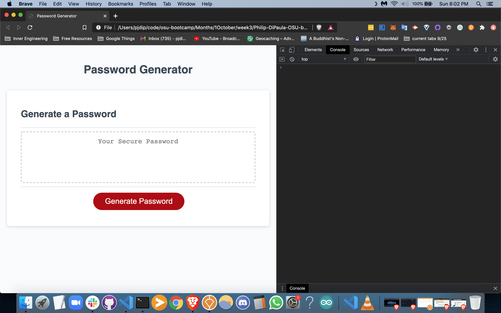
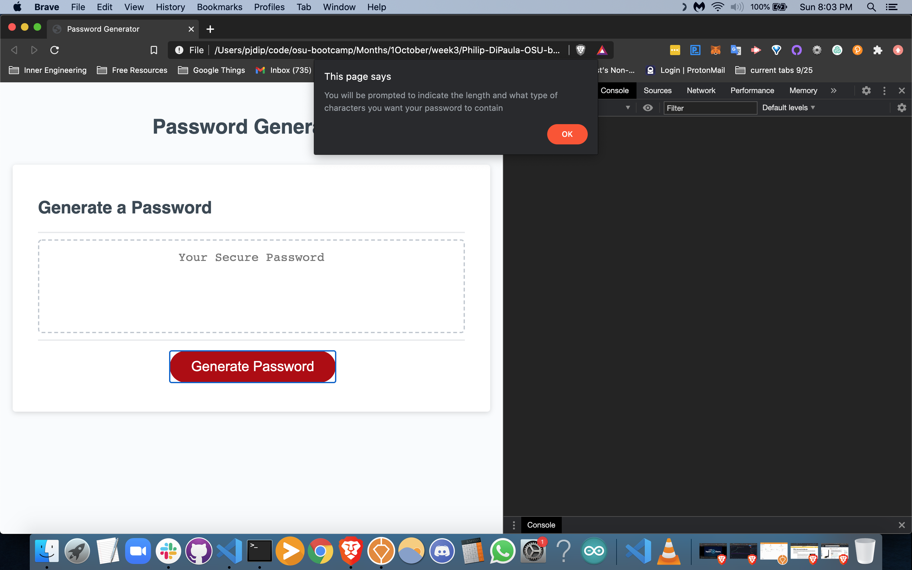
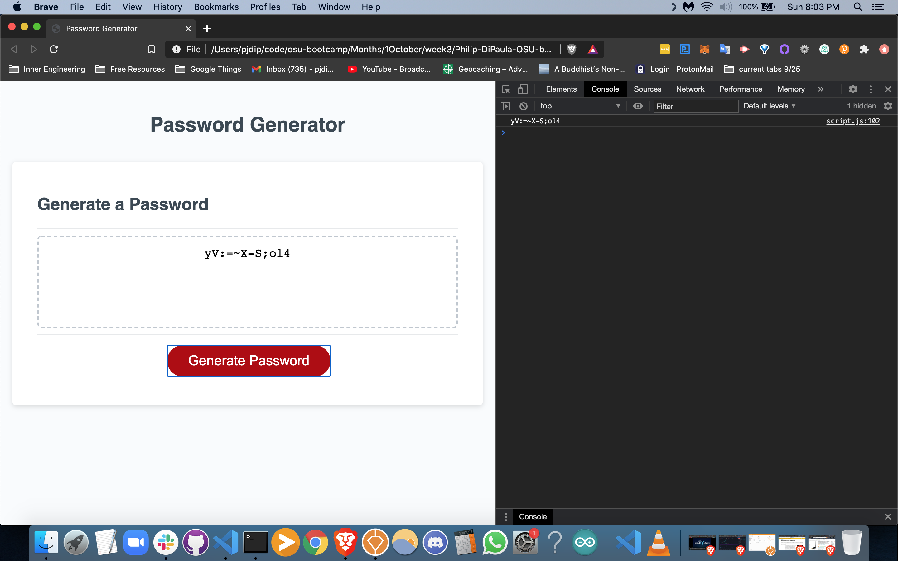

# Philip-DiPaula-OSU-bootcamp-hwk3

## These are the files for the third OSU Web Development Bootcamp Homework Assignment

Here is a [link](https://pjdip.github.io/Philip-DiPaula-OSU-bootcamp-hwk3/) to the live page :D

The goal of this assignment was to play around with javascript in order to build a random password generator. The password to be generated is dependent upon a few simple criteria input by the user. This includes length and which sets of characters to include.

* [Installation](#installation)
* [Usage](#usage)
* [Credits](#credits)
* [Badges](#badges)
* [License](#license)

## Installation

The only thing you will need to have installed in order to run the index.html file is a functioning web browser. It should work with most versions of most browswers. I recommend the Brave browser, as you will be paid in the Basic Attention Token (BAT) for viewing ads, instead of being bombarded with ads and getting nothing for it.

## Usage 

In order to use this project, simply open the index.html in your favorite browser or open the link provided above. Click the "Generate Password" button, and you will be guided through a series of prompts to decide some of the parameters for your password. The length must be input as a number between 8 and 128, inclusive. You have 4 sets of characters to build your password: lowercase letters, uppercase letters, numbers, and special characters. You must choose at least 1 set of characters for building your password. It is recommended to use a large variety of characters for maximum security. When you are done setting your criteria, your password will appear in the box with the place holder "Your Secure Password."

## Credits

Thanks to Mozilla Developer Network for a little clarification on how to manipulate [strings](https://developer.mozilla.org/en-US/docs/Web/JavaScript/Reference/Global_Objects/String/indexOf), [arrays](https://developer.mozilla.org/en-US/docs/Web/JavaScript/Reference/Global_Objects/Array), and [maps](https://developer.mozilla.org/en-US/docs/Web/JavaScript/Reference/Global_Objects/Map/values)

Thanks to stackoverflow friends for information about [checking a string for valid numbers](https://stackoverflow.com/questions/175739/built-in-way-in-javascript-to-check-if-a-string-is-a-valid-number) as well as for syntax on [declaring multiple variables on a single line](https://stackoverflow.com/questions/4166785/javascript-how-to-define-multiple-variables-on-a-single-line)

Thanks to git documentation for help with [branching/merging](https://git-scm.com/book/en/v2/Git-Branching-Basic-Branching-and-Merging)

Special Thanks to [ChilledCow](https://www.youtube.com/channel/UCSJ4gkVC6NrvII8umztf0Ow) for providing chill lofi beats to code to

## Badges

## License

Licensed under the [GNU General Public License v3.0](https://choosealicense.com/licenses/gpl-3.0/)

---

